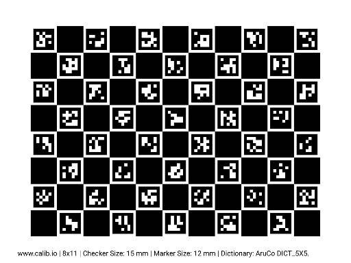
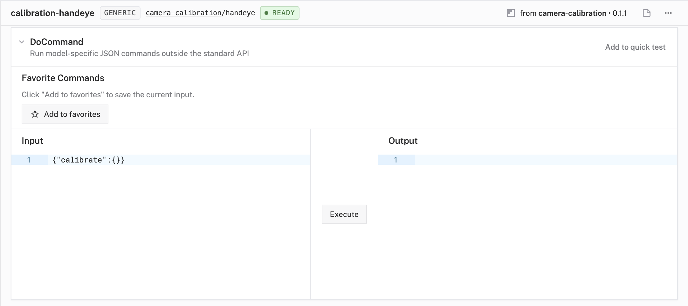
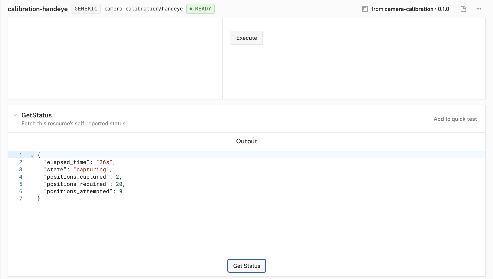
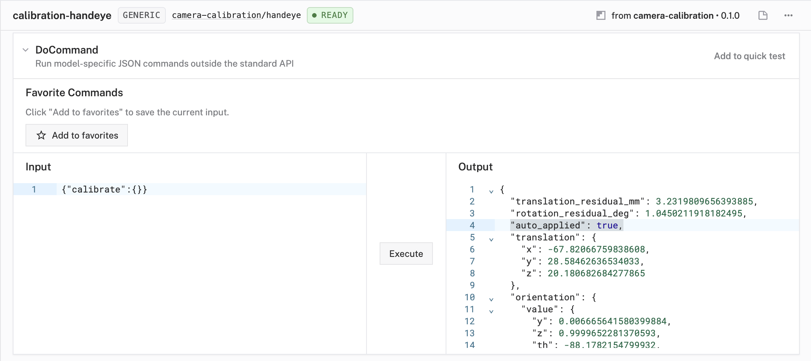

# camera-calibration

**Hand-eye calibration** for arm-mounted cameras on Viam machines.

The goal is fast, good-enough calibration. If a few millimeters of error is fine for your use case, the [Quick Start](#quick-start) gets you there in ~5 minutes. If you need sub-mm precision, you'll need to pay more attention to the quality of the results.

## How It Works

This module figures out where your camera sits relative to the arm's tool flange by moving the arm to ~20 positions, photographing a board from each one, and solving for the transform. On success, it **writes the calibrated frame back to your camera's config automatically**.

## Prerequisites

- Arm component configured on the machine.
- Camera component configured (its `frame` doesn't have to be correct - that's what this module fixes).
- Any obstacles the arm might hit during the sweep modeled as components with geometry.

## Quick Start

### Step 1: Get a calibration board

We suggest a ChArUco board, like the following:



### Step 2: Add the module

In the Viam app, add `viam:camera-calibration` to your machine.

```json
{
  "type": "registry",
  "name": "viam_camera-calibration",
  "module_id": "viam:camera-calibration",
  "version": "latest"
}
```

### Step 3: Configure the pose_tracker

The values below are for the board pictured above — they're here to show how the board's properties map into the config. Use the values from your own board.

```json
{
  "name": "calibration-charuco",
  "api": "rdk:component:pose_tracker",
  "model": "viam:camera-calibration:charuco",
  "attributes": {
    "camera": "your-camera-name",
    "dictionary": "DICT_5X5_100",
    "squares_x": 11,
    "squares_y": 8,
    "square_length_mm": 15,
    "marker_length_mm": 12
  }
}
```

### Step 4: Configure the handeye service

```json
{
  "name": "calibration-handeye",
  "api": "rdk:service:generic",
  "model": "viam:camera-calibration:handeye",
  "attributes": {
    "arm": "your-arm-name",
    "pose_tracker": "calibration-charuco"
  }
}
```

Everything else defaults.

**Strongly recommended**: set `input_range_override` to constrain the arm to your workspace. Without limits, the sweep can whip cables around and damage them.

The following is an example of joint limits on an xArm 6:

```json
"input_range_override": {
  "arm-1": {
    "0": {"Min": -1.5708, "Max": 1.5708},
    "1": {"Min": -1.5708, "Max": 0.5236},
    "2": {"Min": -2.0944, "Max": 0.5236},
    "3": {"Min": -1.5708, "Max": 1.5708},
    "4": {"Min": -1.0472, "Max": 1.5708},
    "5": {"Min": -3.1416, "Max": 3.1416}
  }
}
```

**Note**: if you have joint limits set on the built-in motion service, this module does NOT read them. Duplicate them here.

### Step 5: Position the arm

Manually move the arm so the camera has a clean, close view of the whole board. Board should fill 40-70% of the frame, all corners visible. This becomes the starting pose - the arm returns here after calibrating.

### Step 6: Run calibrate

> **THIS STEP WILL MOVE THE ARM**

From the app's Control tab, on `calibration-handeye`, send:

```json
{"calibrate": {}}
```



Takes a few minutes. 

You can call `Status` on `calibration-handeye` to see progress in real-time.



On success, **your camera's `frame` block in the machine config is updated automatically** — verify by checking `"auto_applied": true` in the response.



If `auto_applied: false`, the calibration ran but the residuals exceeded the auto-apply threshold. The result is still returned; inspect `translation_residual_mm` and `rotation_residual_deg` to decide whether to apply manually or re-run.

## Reference
### `viam:camera-calibration:charuco`


| Field              | Required | Default         | Description                                                                              |
| ------------------ | -------- | --------------- | ---------------------------------------------------------------------------------------- |
| `camera`           | Yes      | —               | Name of the arm-mounted camera to detect on.                                             |
| `dictionary`       | Yes      | —               | ArUco dictionary. `DICT_{4,5,6,7}X{4,5,6,7}_{50,100,250,1000}` or `DICT_ARUCO_ORIGINAL`. |
| `squares_x`        | Yes      | —               | Board width in squares.                                                                  |
| `squares_y`        | Yes      | —               | Board height in squares.                                                                 |
| `square_length_mm` | Yes      | —               | Physical square edge length in mm.                                                       |
| `marker_length_mm` | Yes      | —               | Physical marker edge length in mm (< `square_length_mm`).                                |
| `image_source`     | No       | first available | Stream to pull from a multi-stream camera (e.g. `"color"` on RGB+depth).                 |
| `distortion`       | No       | from camera     | Override the camera's distortion coefficients (see note below).                          |

> **On `distortion`**: for cameras that undistort on-device (e.g. Zivid, Ensenso), set to `[0, 0, 0, 0, 0]`. For cameras that publish real distortion coefficients (e.g. Realsense), leave unset.

### `viam:camera-calibration:handeye`


| Field                         | Required | Default | Description                                                                   |
| ----------------------------- | -------- | ------- | ----------------------------------------------------------------------------- |
| `arm`                         | Yes      | —       | Name of the arm.                                                              |
| `pose_tracker`                | Yes      | —       | Name of the pose_tracker (usually the charuco above).                         |
| `num_poses`                   | No       | 20      | Successful captures required before solving.                                  |
| `workspace_bounds`            | No       | auto    | Sample region for calibration poses. Auto-derived from the board position if omitted. |
| `settle_seconds`              | No       | 2.0     | Delay after each arm move before capturing.                                   |
| `input_range_override`        | No       | —       | Tighten arm joint limits (radians). Same schema as the built-in motion service. |
| `auto_apply_result`           | No       | `true`  | Write the calibrated frame back to the camera's config. Set to `false` to skip the write and inspect the result manually. |
| `target_camera`               | No       | derived | Override which camera's `frame` block gets updated.                           |
| `max_translation_residual_mm` | No       | 5.0     | Skip auto-apply if solve residual exceeds this.                               |
| `max_rotation_residual_deg`   | No       | 2.0     | Skip auto-apply if solve residual exceeds this.                               |
| `min_pose_diversity_deg`      | No       | 30.0    | Skip auto-apply if mean pairwise arm-rotation angle across stations is below this — the solve is mathematically underdetermined regardless of how good residuals look. |


### DoCommands

`calibrate` — runs the full pipeline; takes a few minutes; returns the transform:

```json
{
  "translation": {"x": -37.6, "y": -75.2, "z": 109.5},
  "orientation": {"type": "ov_degrees", "value": {"x": 0.002, "y": 0.002, "z": 1.0, "th": 1.16}},
  "translation_residual_mm": 0.94,
  "rotation_residual_deg": 0.34,
  "auto_applied": true
}
```

`cancel` — halts a running calibrate.

```json
{"cancel": {}}
```

`Status` (standard RDK, not DoCommand) — poll from a second client during a run:

```json
{
  "state": "capturing",
  "positions_captured": 6,
  "positions_required": 20,
  "positions_attempted": 8,
  "elapsed_time": "1m 12s"
}
```

States: `ready | capturing | solving | applying | complete | failed`.
